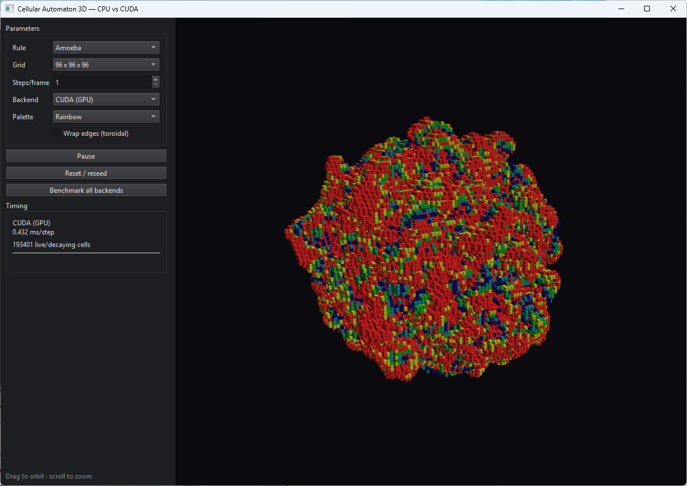

# Cellular Automaton 3D — CPU vs CUDA

A real-time **3D cellular automaton** built with **Qt 6 (C++17)** and **OpenGL**,
computed on three back-ends so you can compare their performance live:

- **CPU (single-threaded)** — baseline
- **CPU (multi-threaded)** — the same rule parallelized across z-slabs with `std::thread`
- **CUDA (GPU)** — one thread per cell

The living cells are rendered as **instanced cubes** in an OpenGL 3.3 core-profile
viewport with an orbit camera and simple lighting. Decaying cells fade through a
color gradient, producing coral- and crystal-like structures.



## What it demonstrates

- A **3D stencil** compute pattern (each cell reads its 26 Moore neighbors) — the
  natural 3D extension of the 2D stencil, mapped onto the GPU with a 3D thread grid.
- **Instanced 3D rendering**: one cube mesh drawn thousands of times with a
  per-instance position + state buffer, so tens of thousands of live cells render
  in a single draw call.
- The same CPU-vs-GPU methodology as the rest of the series, on a workload that is
  both compute- and memory-touching (26 neighbor reads per cell).

## Rules

Uses the state-decay "life-like" model over the 26-cell Moore neighborhood.
Included presets (survive / birth counts, number of states):

- **445** — survive 4, birth 4, 5 states (classic growing blob)
- **Pyroclastic** — survive 4–7, birth 6–8, 10 states
- **Amoeba** — survive 9–26, birth {5–7,12,13,15}, 5 states
- **Clouds** — survive 13–26, birth {13,14,17–19}, 2 states
- **Crystal** — survive 5–8, birth {1,3}, 5 states

A cell that stops surviving does not die instantly; it decays through the
intermediate states, which is what creates the shells and trails.

## Features

- Switchable rule presets and grid size (32³ / 48³ / 64³ / 96³)
- Adjustable steps-per-frame
- Drag to orbit, scroll to zoom
- Play / Pause / Reset (reseed)
- **Benchmark all backends** — advances a fixed batch on each back-end from the
  same starting grid and reports ms-per-step plus speedup vs single-threaded CPU

## Requirements

- **Qt 6** (Widgets, OpenGL, OpenGLWidgets modules)
- **CMake 3.20+**
- A C++17 compiler (MSVC 2022 / GCC / Clang)
- An OpenGL 3.3-capable GPU (basically anything modern)
- For the CUDA back-end: **NVIDIA CUDA Toolkit** and an NVIDIA GPU
  (without them, the project builds CPU-only and the CUDA option disappears)

## Building (Windows, with CUDA)

CUDA on Windows requires the **MSVC** host compiler, so use a Qt build for MSVC
(e.g. `C:\Qt\6.x.x\msvc2022_64`).

```powershell
cmake -B build -S . -A x64 -DCMAKE_PREFIX_PATH="C:/Qt/6.x.x/msvc2022_64" -DUSE_CUDA=ON -DCUDA_ARCH=89
cmake --build build --config Release
```

Or edit `generate_vs_solution.bat` (set `QT_DIR`) and double-click it to produce
`build\CellularAutomaton3D.sln`.

## Building without CUDA (CPU only — e.g. macOS)

```bash
cmake -B build -S . -DUSE_CUDA=OFF -DCMAKE_PREFIX_PATH="/path/to/Qt/6.x.x/<kit>"
cmake --build build
```

## Implementation notes

- `Types.h` and `CARule.h` are Qt-free and compile under both a normal C++
  compiler and nvcc. The `CA_HD` macro shares one rule/step implementation
  between the CPU and the GPU.
- The grid state is authoritative on the host; the CUDA back-end uploads it,
  iterates on the device (ping-pong buffers, no per-step copies), and downloads
  the result. The reported time is the honest wall time for a batch of steps.
- Rendering is decoupled from simulation: after each step the host scans the grid
  and uploads a compact instance buffer (4 floats per live cell) to the GPU.

## Possible improvements

- **CUDA–OpenGL interop**: keep the grid on the GPU and generate the instance
  buffer on the device, removing the per-frame host readback entirely.
- Shared-memory tiling of the 3D stencil (load a tile plus halo per block).
- Marching cubes for a smooth iso-surface instead of discrete voxels.
- Paint/erase cells directly in the 3D view.

## License

MIT — do whatever you like, no warranty.

## Support

If you found this project interesting or useful, you can support my work:

[](https://github.com/sponsors/makarov-mm)